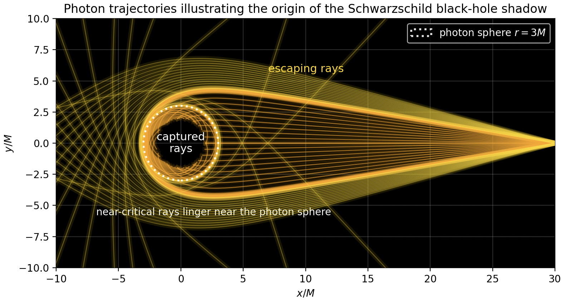
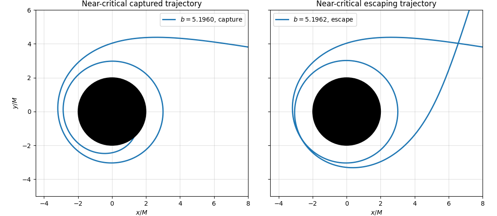
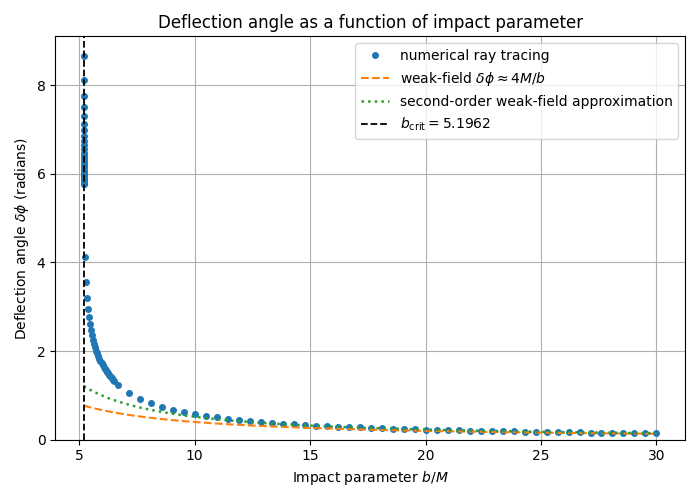
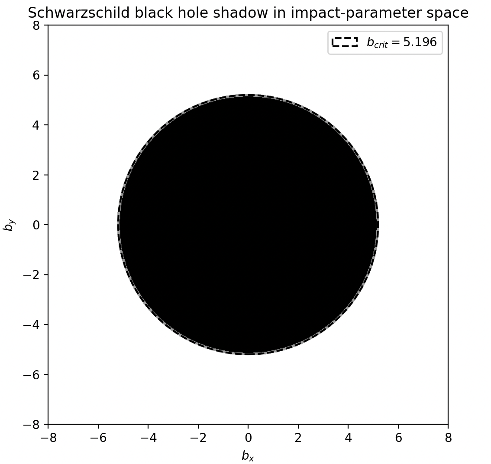

# Schwarzschild Black Hole Ray Tracing

A Python-based numerical study of photon trajectories and the capture-escape boundary for null geodesics in Schwarzschild spacetime.



## Overview

This project was developed as part of my bachelor's thesis, "Photon Orbits and the Schwarzschild Black Hole Shadow", at University College Roosevelt, Utrecht University.

The project implements a numerical ray tracer for equatorial Schwarzschild null geodesics and investigates the transition between photon capture and escape near the critical impact parameter.

The code also examines gravitational deflection, near-critical orbital winding, the idealised Schwarzschild shadow, and sensitivity to numerical solver parameters.

## Key Features

- Numerical integration of Schwarzschild null geodesics
- Capture and escape classification
- Calculation of the critical impact parameter
- Radial turning-point detection and branch switching
- Gravitational deflection-angle calculations
- Comparison with weak-field analytical approximations
- Near-critical trajectory and winding analysis
- Schwarzschild shadow construction
- Shadow angular-size calculations
- Numerical tolerance and sensitivity studies

## Numerical Method

The numerical implementation uses a reduced formulation of the Schwarzschild null-geodesic equations with geometric units:

$$
G = c = M = 1
$$

The equations are integrated using SciPy's `solve_ivp` with adaptive numerical integration and event-based stopping conditions.

The ray tracer handles inward and outward radial branches separately and detects capture, escape, and turning-point events.

## Results

### Near-Critical Capture and Escape

The critical impact parameter separates photon trajectories that are captured by the black hole from those that escape to large radius.

The figure below compares two trajectories with impact parameters very close to the critical value.



### Deflection Angle

Numerically calculated deflection angles are compared with weak-field analytical approximations as a function of impact parameter.



### Schwarzschild Black-Hole Shadow

The idealised Schwarzschild shadow is constructed in impact-parameter space using the critical impact parameter.



## Numerical Sensitivity

The project also includes numerical sensitivity experiments examining the effects of solver tolerances, maximum step size, and branch-switching parameters on the calculated trajectories and deflection angles.

## Technologies

- Python
- NumPy
- SciPy
- Pandas
- Matplotlib
- Numerical ODE integration
- Computational physics
- Scientific visualisation

## Repository Structure

| File | Purpose |
|---|---|
| `constants.py` | Physical and numerical parameters |
| `equatorial_solver.py` | Core null-geodesic ray tracer |
| `deflection_angle.py` | Numerical deflection-angle calculations |
| `shadow.py` | Schwarzschild shadow construction |
| `shadow_rays.py` | Near-critical ray and winding analysis |
| `sidebyside.py` | Capture versus escape comparison |
| `experiments.py` | Ray-tracing experiments and visualisation |
| `tol_values.py` | Numerical tolerance and sensitivity studies |

## Installation

Clone the repository and install the required Python packages:

```bash
pip install -r requirements.txt
```

## Author

**Tjibuya Dineke Deurwaarder**

Bachelor's Thesis  
University College Roosevelt, Utrecht University  
2026
